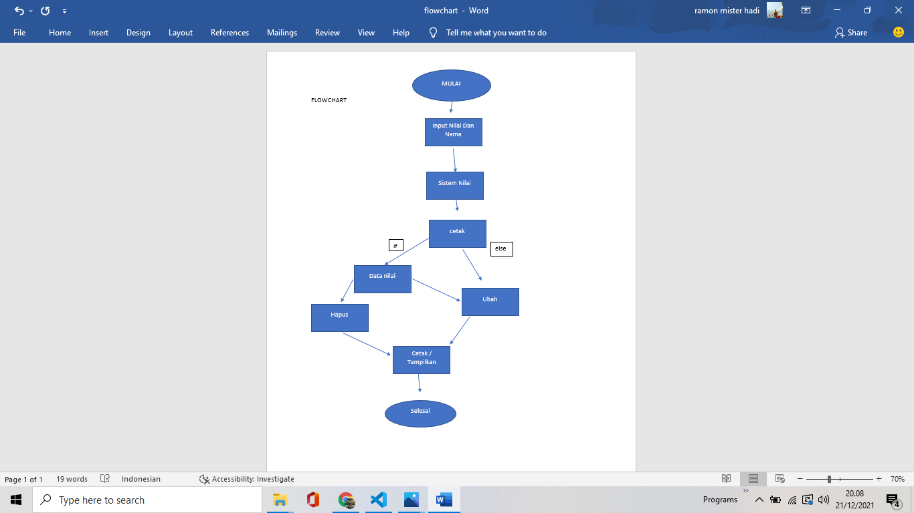

## Tugas Menyelesaikan UAS BAHASA PEMROGRAMAN
| Nama | kelas | Nim | Matkul |
| -- | --- | ---- | ----------- |
| Ramon mister hadi | TI.AA1.21 | 312010508 | Bahasa Pemrograman |
## Daftar Isi
| No | ISI | Link | Source Code |
| -- | --- | ---- | ----------- |
| 1. | File Program | Tugas Praktikum | [codenye](https://github.com/Tangker17/pertemuan-12/blob/main/Program_Nilai.py) |
| 2. | Flowchart | Flowchart ) | [file](https://github.com/Tangker17/pertemuan-12/blob/main/flowchart.png) |  

# Tugas Praktikum class
- Kelas atau class pada python bisa kita katakan sebagai sebuah blueprint (cetakan) dari objek (atau instance) yang ingin kita buat. Kelas adalah cetakannya atau definisinya, sedangkan objek (atau instance) adalah objek nyatanya.

Membuat Program sederhana berdasarkan tugas praktikum yang sebelumnya dengan struktur seperti berikut:

- pertemuan 12.py berisi modul untuk: tambah_data, ubah_data, hapus_data, dan lihat_data
- Tambah Data / Input Data 

```
def pilih1():
	ulang = 'Y'
	while ulang in('y', 'Y'):
		os.system('cls')
		siswaNilai = Mahasiswa() 
		print(" DATA NILAI UTS MAHASISWA ") 
		siswaNilai.nilai = (int(input("masukkan nilai anda : "))) 
		siswaNilai.nama = (input("masukkan nama siswa : ")) 
		dataSiswa.append(siswaBaru) 
		ulang = input("Apakah Anda Ingin Menambahkan data nilai siswa (Y/ T)? ")		

menu()
```

- Tampilkan Data dari hasil inputan tersebut dengan code 

```
def tampil():
	os.system('cls');
	print("DATA MAHASISWA")

	for data in dataSiswa:
		print("Nilai : "+str(data.nilai)) 
		print("Nama : "+data.nama) 
		print("----------------------")
```

- Method Menghapus Data Berdasarkan Nilai Dan Nama 

```
elif pilih ==4:
		os.system('cls') 
		tampil()
		index_delete=-1
		id_hapus = int(input("Input Nilai yang akan di hapus : ")) 
		for a in range(0, len(dataSiswa)): 
			if id_edit == dataSiswa[a].nilai:
						index_update = a
						break
		if(index_delete > -1):
			del dataSiswa[index_delete]
			print("Data Telah di hapus") 
		else : print("siswa tidak ditemukan")
		input("kembali menu utama") 
		menu()
	elif pilih == 5 :
		author()
		input("\n\n kembali menu utama") 
		menu()
	elif pilih == 6 :
		sys.exit()
 ```
- Method Ubah DATA Berdasarkan Nilai Dan Nama 

``` 
elif pilih == 3:
		index_update=-1
		tampil()
		id_edit = int(input("Input Nilai UTS yang akan di update ")) 
		for a in range(0, len(dataSiswa)): 
			if id_edit == dataSiswa[a].nilai: 
					index_update = a 
					break 
		if(index_update > -1): 
			print("INPUT DATA YANG DI UPATE ") 
			siswa = Mahasiswa() 
			siswa.nilai = (int(input("masukkan nilai anda : "))) 
			siswa.nama = (input("masukkan nama siswa : ")) 
			dataSiswa[index_update] = siswa 
			print("berhasil update data siswa") 
		else : print("nilai tidak ditemukan") 
		input("kembali menu utama") 
		menu()
```

# Tugas Flowchart
- Diagram alir bagan alir, atau bagan arus adalah sebuah jenis diagram yang mewakili algoritme, alir kerja atau proses, yang menampilkan langkah-langkah dalam bentuk simbol-simbol grafis, dan urutannya dihubungkan dengan panah
Dengan Contoh Dibawah Ini !

